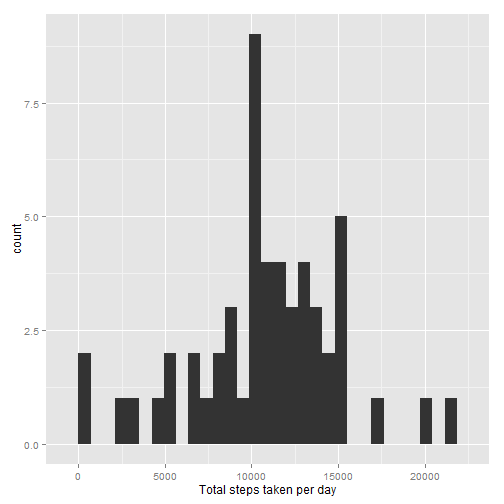
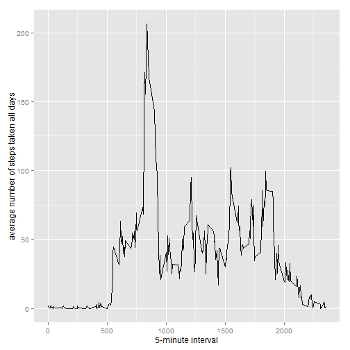
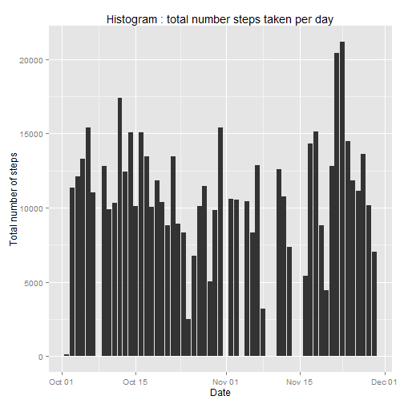
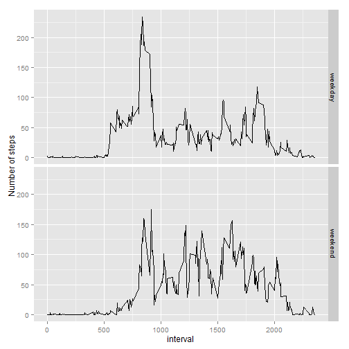

opts_chunk$set(echo = TRUE)


```r
library("knitr")  

library("rmarkdown")  

library("dplyr")

library("ggplot2")  
```

## Loading and preprocessing the data

```r
activityData = read.csv("activity.csv")  
data = na.omit(activityData)  
data$date = as.Date(data$date, format = "%Y-%m-%d")    
data$interval = as.factor(data$interval)  
#data
```

## What is mean total number of steps taken per day?

```r
totalSteps <- tapply(data$steps, data$date, sum, na.rm=TRUE)
qplot(totalSteps, xlab="Total steps taken per day")
```

```
## stat_bin: binwidth defaulted to range/30. Use 'binwidth = x' to adjust this.
```

 

```r
mean(totalSteps, na.rm=TRUE)
```

```
## [1] 10766.19
```

```r
median(totalSteps, na.rm=TRUE)
```

```
## [1] 10765
```

## What is the average daily activity pattern?

```r
avg <- aggregate(data$steps, 
                 by=list(interval=data$interval),
                 mean, 
                 na.rm=TRUE)
## avoid "geom_path: Each group consist of only one observation. Do you need to adjust the group aesthetic?" error by converting interval levels to numbers
avg$interval <- as.integer(levels(avg$interval)[avg$interval])
colnames(avg) <- c("interval", "steps")
ggplot(avg, aes(x=interval, y=steps)) + geom_line() +
                 xlab("5-minute interval") +
                 ylab("average number of steps taken all days")
```

 

```r
# get row with max steps from which.max
avg[which.max(avg$steps),]
```

```
##     interval    steps
## 104      835 206.1698
```
## Imputing missing values

```r
#sum(!complete.cases(data))
completeData <- data 
#colnames(completeData)
for (i in 1:nrow(completeData)) {
    if (is.na(completeData$steps[i])) {
        completeData$steps[i] <- avg[which(completeData$interval[i] == avg$interval), ]$steps
    }
}
#show count of missing values
sum(!complete.cases(completeData))
```

```
## [1] 0
```

```r
ggplot(completeData, aes(date, steps)) + 
       geom_bar(stat = "identity",binwidth = .5) +
       labs(title = "Histogram : total number steps taken per day",
            x = "Date", 
            y = "Total number of steps")
```

 

```r
mean(as.numeric(tapply(completeData$steps,completeData$date, sum)))
```

```
## [1] 10766.19
```

```r
median(as.numeric(tapply(completeData$steps,completeData$date, sum)))
```

```
## [1] 10765
```

## Are there differences in activity patterns between weekdays and weekends?

```r
#translate date values to day of week
completeData$week <- as.factor(format(completeData$date, "%a"))
#table(completeData$week)
#week now is Mon/Tue....etc that is abbreviated
#now classify Mon to Fri as Weekday and rest as weekend
levels(completeData$week) <- list(weekday = c("Mon", 
                                              "Tue",
                                              "Wed", 
                                              "Thu", 
                                              "Fri"),
                                 weekend = c("Sat", "Sun"))
modifiedAvg <- aggregate(completeData$steps ~ completeData$interval + completeData$week, data=completeData, mean)
#modifiedAvg
#assign new col names
colnames(modifiedAvg) = c("interval","week","steps")
## avoid "geom_path: Each group consist of only one observation. Do you need to adjust the group aesthetic?" error by converting interval levels to numbers
intLevels <- as.integer(levels(modifiedAvg$interval)[modifiedAvg$interval])
ggplot(modifiedAvg, aes(intLevels, steps)) + geom_line() + facet_grid(week ~ .) + xlab("interval") + ylab("Number of steps")
```

 
